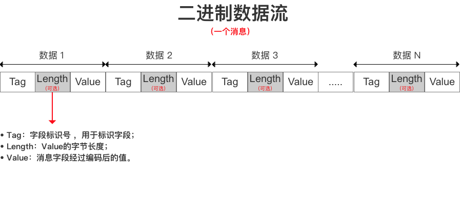

##按字节定义网络、蓝牙数据传输格式

先了解`number`、`string`、`json格式数据`、`文件`到二进制data数据的相互转换（Object-C）

---
**number --> data**

```
NSInteger number = 101;
NSData* numberData = [NSData dataWithBytes:& number length:4];

```

**data --> number**

```
NSInteger number = 0;//一定要给初始值，否则得出的结果是错误的
[data getBytes:&number range:NSMakeRange(0, 4)];//然后你的number里就有值了

```

---
**string --> data**

```
NSString* message = @"Hello World!";
NSData* data = [message dataUsingEncoding:(NSUTF8StringEncoding)];
```

**data --> string**

```
NSString* message = [[NSString alloc] initWithData:data encoding:NSUTF8StringEncoding];
```
---

**json格式数据(字典、数组或者更深层的嵌套) --> data**

```
NSArray* array = @[@{@"key": @"value"}, @(2)];
NSError* error = nil;
NSData* data = [NSJSONSerialization dataWithJSONObject:array options:kNilOptions error:&error];
```

**data --> json格式数据**

```
NSMutableArray* mutableArray = [NSJSONSerialization JSONObjectWithData:data options:(NSJSONReadingMutableContainers) error:&error];
if ([mutableArray isKindOfClass:[NSMutableArray class]]) {
	NSLog(@"转换成功");
}
```

---
**文件 --> data**

```
NSData* data = [NSData dataWithContentsOfFile:@"/document/fileName.mp3"];
```

注：文件大的时候不可以直接全部转为data放到内存中，发送的时候可`分段读取`到buffer中，系统自带的类`NSInputStream` 、`NSOutputStream `、 `NSFileHandle `均可以。

**data --> 文件**

```
图片示例
UIImage* image = [UIImage imageWithData:data]

```

注：文件一般尽量不要在内存里加载为data去直接使用，会比较占用内存，一般都会把data写入本地再去调用

---


###直接上代码压压惊（Object-C）

自定义一个数据，格式如下：


**定义一个待发送的data数据**

```
    NSString* message = @"Hello World!";
    NSData* data = [message dataUsingEncoding:(NSUTF8StringEncoding)];
    NSInteger type = 101;
    
    NSMutableData* mutData = [NSMutableData data];
//    1~4字节表示类型
    NSData* typeData = [NSData dataWithBytes:&type length:4]; //sizeof(type)
    [mutData appendData:typeData];
    
//    5~8字节表示数据总长度
    NSInteger bodyLength = data.length + 4 + 4;
    NSData* lengthData = [NSData dataWithBytes:&bodyLength length:4];
    [mutData appendData:uuidData];
    
//    再将文字追加上
    [mutData appendData:data];
    
    mutData 可直接传输

```

**解析收到的data数据**

`mutData ` 就是最后要传输的数据，存储的是二进制数据，任何地方都适用。接收到的二进制数据需要再按字节解析，代码如下（Object-C）

```
另一个终端接收到了二进制数据data，开始解析

//    1~4字节表示类型
	NSInteger type = 0;//一定要给初始值，否则得出的结果是错误的
   [data getBytes:&type range:NSMakeRange(0, 4)];
	NSLog(@"数据类型: %ld", (long)type);
        
	//    5~8字节表示数据总长度
	NSInteger msgLength = 0;//一定要给初始值，否则得出的结果是错误的
	[data getBytes:&msgLength range:NSMakeRange(4, 4)];
	NSLog(@"数据长度: %ld", (long)msgLength);
        
	NSData* msgData = [data subdataWithRange:NSMakeRange(8, data.length - 8)];
	NSString* str = [[NSString alloc] initWithData:msgData encoding:NSUTF8StringEncoding];
	NSLog(@"接收到的消息为：%@", str);

```

需要demo验证下上面的结论，写了个`socket`在局域网中的通信demo，地址为localhost，可以直接在同一台电脑运行，或者连接地址改为局域网的真实IP地址即可。
[Socket局域网通信Demo](https://www.baidu.com)

###为什么要定义协议呢？

####1、硬件厂商的协议多样
这个避免不了，硬件有自己的通信规则，我们改不了，只能适应厂商。比如一个蓝牙设备需要用手机去修改时间，协议如下：

| 指令  | 注释     |
|:---- |:------------:| 
| 0x3E | 身份验证(固定)     | 
| 0x02 | 修改时间指令       |                  
| 0x12 | 18年          |              
| 0x06 | 6月           |              
| 0x02 | 2日           |              
| 0x0F | 15点          |              
| 0x3A | 58分          |                          
| 0x62 | 校验位			|

注：校验位是年、月、日、时、分的总和

最后发送的数据格式为：

```
0x3E 02 12 06 02 0F 3A 63
```

####2、`Json` 、`XML`格式数据冗余的东西太多
Json最常用的格式key-value方式，使用起来简直是太方便了。不过经常看到有的key很长，有点冗余。
>* 如果不要key，用数组是否可以？
>* 事先定义一种协议按字节去取可不可以？

问过一个做游戏的朋友，他说他们不用字典这个东西，key这个字段有点多余，他们用数组或者是按字节定义。

为什么都说[Protocol Buffer]()会比json数据节省一半或者更多的数据量呢？可参考文章

[Protocol Buffer 序列化原理大揭秘 - 为什么Protocol Buffer性能这么好？](https://blog.csdn.net/carson_ho/article/details/70568606)

[Google Protocol Buffer 的使用和原理](https://www.ibm.com/developerworks/cn/linux/l-cn-gpb/index.html)

文中讲述了 `T - V`、`T - L - V ` 的数据存储方式，如下图：



####3、避免出现数据解析不了的情况

```
“为啥安卓能解析，你就不能解析”
“你们都用的同一个框架肯定能解析啊”
“不行我再给你单独开个接口”
“……”
```

iOS跟Java后台传输数据的时候经常有个问题，那就是数据经常解析不了或者是上传不了。其实有个特别好的办法：就是俩人都不用三方框架，直接用二进制数据交流，就能找到问题了！

出现这种情况的时候，大家要冷静下，想想为什么会有**这种情况？** **如何解决？**

```
其实你们谁都没有错，只是没有约定好协议。
```
>* 你的前八字节表示长度，他把前八字节当成字母解析了
>* 你用--boundary--分割，他用逗号分割
>* 你发的jsonObject，他按jsonString解析
>* ……

**既然协议不统一，怎么写都不会通的。**

**解决办法**
>* 用三方的那就需要去看看源代码了
>* 放弃三方，直接用系统提供的方法发送、接收二进制类型数据。

放弃三方直接用系统的API发送，这个使用简单，约定好即可。优化麻烦，比如长的data的读取、发送、接收、分割，可阅读AFN的源码看看是如何处理的。

---
感谢您阅读完毕，如有疑问，欢迎添加QQ:714387953(蜗牛上高速)。
[github:https://github.com/yhl714387953/Socket局域网通信Demo](github:https://github.com/yhl714387953/Socket局域网通信Demo)
如果有错误，欢迎指正，一起切磋，共同进步
如果喜欢可以Follow、Star、Fork，都是给我最大的鼓励。
